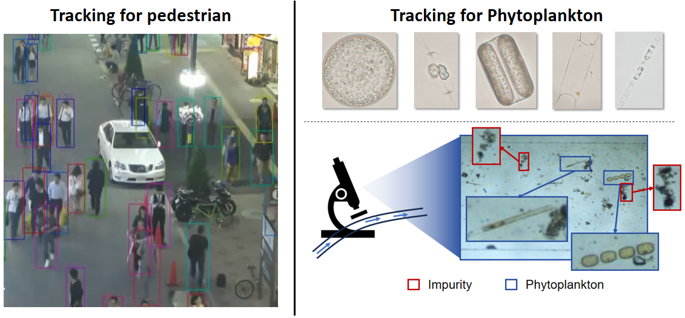
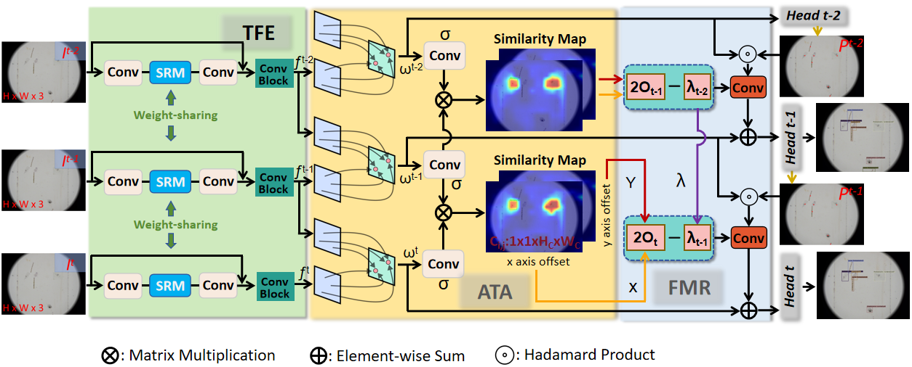
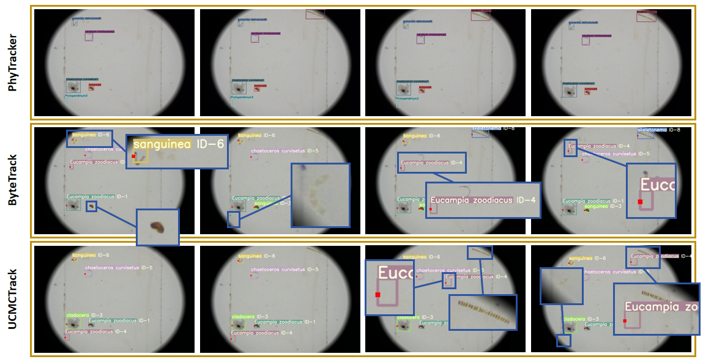
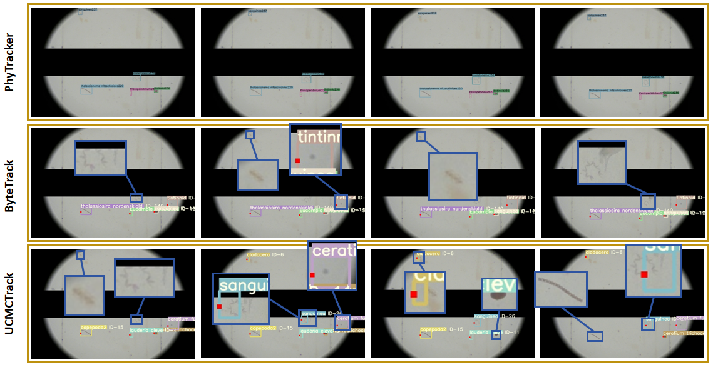

<!-- # PhyTracker: An Online Tracker for Phytoplankton -->


## PhyTracker: An Online Tracker for Phytoplankton

Yang Yu, Qingxuan lv, [Yuezun Li](https://yuezunli.github.io/), Zhiqiang Wei, Junyu Dong

Yuezun Li and Junyu Dong are corresponding authors

Ocean University of China, China

IEEE Transactions on Circuits and Systems for Video Technology(TCSVT), 2024

*[arXiv 2407.00352](https://arxiv.org/abs/2407.00352)*

### Contents
1. [Abstract](#Abstract)
2. [Overall structure diagram](#Overall-structure-diagram)
3. [Tracking performance](#Tracking-performance)
4. [Installation](#Installation)
5. [Run Demo](#Run-Demo)
6. [Data preparation](#Data-preparation)
7. [Training](#Training)
8. [Citation](#Citation)
9. [Acknowledgement](#Acknowledgement)


### Abstract
Phytoplankton, a crucial component of aquatic ecosystems, requires efficient monitoring to understand marine ecological processes and environmental conditions. Traditional phytoplankton monitoring methods, relying on non-in situ observations, are time-consuming and resource-intensive, limiting timely analysis. To address these limitations, we introduce PhyTracker, an intelligent in situ tracking framework designed for automatic tracking of phytoplankton. PhyTracker overcomes significant challenges unique to phytoplankton monitoring, such as constrained mobility within water flow, inconspicuous appearance, and the presence of impurities. Our method incorporates three innovative modules: a Texture-enhanced Feature Extraction (TFE) module, an Attention-enhanced Temporal Association (ATA) module, and a Flow-agnostic Movement Refinement (FMR) module. These modules enhance feature capture, differentiate between phytoplankton and impurities, and refine movement characteristics, respectively. Extensive experiments on the PMOT dataset validate the superiority of PhyTracker in phytoplankton tracking, and additional tests on the MOT dataset demonstrate its general applicability, outperforming conventional tracking methods. This work highlights key differences between phytoplankton and traditional objects, offering an effective solution for phytoplankton monitoring.
<p align="center"></p>


### Overall structure diagram

<p align="center"></p>


### Tracking performance
Performance of different algorithms on the no-noise phytoplankton dataset.
| Method    |  IDF1 | MOTA | FP | FN | IDs |
|------------|-------|------|------|-------|-------|
|Sort       |  69.3 | 55.4 |  **171** | 3829 | 392 |
|DeepSort   |  24.7 | 39.1 |  1906 |  4032 | 53  |
|DeepMot   |  16.9  | 40.8 |  2038 |  3737 | 52  |
|TraDeS     | 85.4 | 78.3 | 417 | 1641 | 81 | 
|BotSort    | 57.9 | 40.0 |  594 | 5239 | 70 |
|ByteTrack  | 84.6 | 71.8 |  588 | 2183 | **2** |
|UAVMot     | 83.2 | 69.7 |  601 | 2375 | 11 |
|StrongSort | 48.3 | 37.0 |  792 | 4612 | 794 |
|UCMCTrack  | 61.2 | 56.4 |  153 | 2467 | 425 |
|BoostTrack | 86.4 | 75.6 |  306 | 1746 | 6 |
|TLTDMOT    | 85.2 | 74.3 |  307 | 1557 | 46 |
|**PhyTracker**   | **88.4** | **80.8** | 356 | **1482** | 55 |

In MOT17, PhyTracker outperforms TraDeS in IDF1, MOTA, and FN metrics.
| Method    |  IDF1 | MOTA | FP | FN | IDs |
|------------|-------|------|------|-------|-------|
|TraDeS     | 58.2 | 51.8 | **1091** | 2554 | **38** | 
|**PhyTracker**   | **60.4** | **53.6** | 1123 | **2465** | 41 |


### Installation
The code was tested with Anaconda Python 3.6, CUDA 10.0, and PyTorch v1.3. Check your gcc version by 'gcc -v'. gcc version may need to be higher than v4.8 in order to compile the DCNv2 package. We tested the code with both gcc v5.4.0 and v8.4.0. After installing Anaconda:

0. [Optional but highly recommended] create a new conda environment.
```shell
conda create --name PhyTracker python=3.6
```

And activate the environment.

```shell
conda activate PhyTracker
```

1. Install PyTorch:
```shell
conda install pytorch=1.3.1 torchvision=0.4.2 cudatoolkit=10.0.130 -c pytorch
```

2. Install COCOAPI:
```shell
pip install cython; pip install -U 'git+https://github.com/cocodataset/cocoapi.git#subdirectory=PythonAPI'
```

3. Clone this repo:
```shell
git clone https://github.com/OUC-PVOA/PhyTracker.git
```

4. Install the requirements
```shell
cd $PhyTracker_ROOT
pip install -r requirements.txt
```

5. Compile deformable convolutional (Successuflly compiled with both gcc v5.4.0 and v8.4.0. gcc version should be higher than v4.8).
```shell
cd $PhyTracker_ROOT/src/lib/model/networks/DCNv2
. make.sh
```

(modified from DCNv2)

Note: We found the nuScenes and MOT dataset API versions are not compatible, you can switch between them by running 'sh mot_switch_version.sh' (for MOT experiments) or 'sh nuscenes_switch_version.sh' (for nuScenes experiments). The default installed versions are for MOT dataset.

### Run Demo
The model weights are placed in the link: [[PyTracker2024(code:wnti)]](https://pan.baidu.com/s/10Bq9ke_yHpj929eUSckHEA). Then, cd `PyTracker_ROOT/src/`. The demo result will be saved as a video in `PyTracker_ROOT/results/`.

```shell
python demo.py tracking --dataset PMOT2023 --load_model ../models/PyTracker.pth --demo ../videos --pre_hm --ltrb_amodal --pre_thresh 0.5 --track_thresh 0.4 --inference --clip_len 3 --trades --save_video --resize_video --input_h 640 --input_w 960
```

<p align="center"></p>
<p align="center"></p>


### Data preparation

```
datasets
   |——————MOT
   |        └——————train
   |        └——————test
   └——————PMOT2023
            └——————train
            └——————test
```

Then, you need to change the dataset to coco format:

```shell
cd $PyTracker_ROOT/src/tools/
python convert_mot_to_coco.py
```


### Training
You can use the following command to train：

```shell
python main.py tracking --exp_id PMOT2023 --dataset PMOT2023 --ltrb_amodal --pre_hm --shift 0.05 --scale 0.05 --hm_disturb 0.05 --lost_disturb 0.4 --fp_disturb 0.1 --num_epochs 60 --lr_step 39,51 --save_point 20,30,40,50 --gpus 0 --batch_size 5 --lr 2.0e-4 --num_workers 8 --clip_len 3 --max_frame_dist 10 --trades
```


### Citation
```
@article{yu2024phytracker,
  title={PhyTracker: An Online Tracker for Phytoplankton},
  author={Yu, Yang and Lv, Qingxuan and Li, Yuezun and Wei, Zhiqiang and Dong, Junyu},
  journal={IEEE Transactions on Circuits and Systems for Video Technology},
  year={2024},
  publisher={IEEE}
}
```

### Acknowledgement

A large part of the code is borrowed from [TraDeS](https://github.com/JialianW/TraDeS) and [Efficient Attention](https://gitcode.com/gh_mirrors/ef/efficient-attention). Many thanks for their wonderful works.
